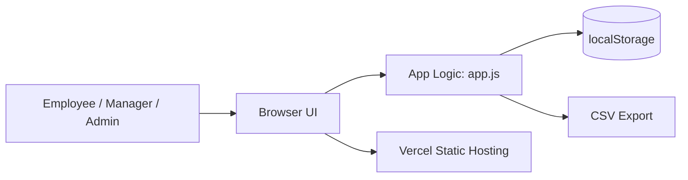

# Submission-Ready Deployment & Demo Checklist

This guide gives you a direct, practical path to publish the portal and present it to judges.

## 1) Get a Real Public URL (Vercel)

### Prerequisites
- Node.js installed
- A Vercel account

### Deploy steps
```bash
npm i -g vercel
cd /workspace/ATOM-QUEST-
vercel login
vercel --prod
```

Vercel will print a live URL, for example:
- `https://goal-intelligence-platform.vercel.app`

Because this app is static (`index.html`, `app.js`, `styles.css`), no backend env vars are needed.

---

## 2) Demo Credentials / Role Access

This build uses a role switcher instead of password auth for quick judging demos.

### Demo flow
- Open app URL
- Use **Switch Role** in the top header:
  - Employee
  - Manager (L1)
  - Admin / HR

---

## 3) Judge Walkthrough (End-to-End)

## Employee Journey
1. Switch role to **Employee**.
2. Click **AI Suggest Goals** (or manually add goals).
3. Confirm validation constraints:
   - max 8 goals
   - min 10% each
   - total 100% before submit
4. Click **Submit Goal Sheet**.
5. Update Achievement and Status for quarterly check-ins.

## Manager Journey
1. Switch role to **Manager (L1)**.
2. Review Goal Board and **AI Risk Alerts**.
3. Add structured feedback in comment box.
4. Click **Approve & Lock** (or **Return for Rework**).

## Admin Journey
1. Switch role to **Admin / HR**.
2. Review KPI cards:
   - Check-in Completion
   - Predicted Risk Goals
   - Completed Goals
3. Verify **Audit Trail** entries.
4. Click **Export CSV** for achievement report.
5. Click **Unlock Goals** when exception handling is needed.

---

## 4) Architecture Diagram (for submission)

Use this simple architecture in your PPT/PDF:

- **Frontend:** Static SPA (HTML/CSS/Vanilla JS)
- **State Layer:** Browser `localStorage`
- **Hosting:** Vercel static deployment (CDN)
- **Export:** Client-side CSV generation

### Mermaid (optional)


---

## 5) BRD Mapping Snapshot

- Goal creation: ✅
- Approval workflow + lock/rework: ✅
- Quarterly tracking + statuses: ✅
- Dashboard + KPIs: ✅
- Report export (CSV): ✅
- Audit log: ✅
- AI goal suggestion + risk alerts: ✅

---

## 6) Final Submission Package

Provide:
1. Live URL (from Vercel `--prod`)
2. Repository URL
3. Architecture diagram (PDF/image)
4. Demo-role instructions (role switcher)

